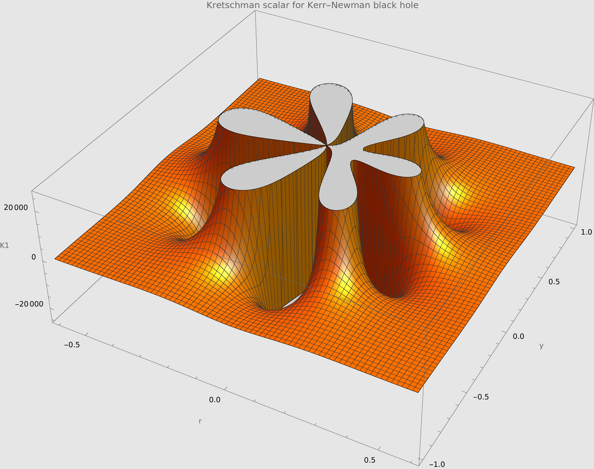

# Determining curvature invariants for the Kerr-Newman black hole

The objective of this project is to calculate curvature invariants linked to metrics that describe black holes, solutions derived from the Einstein equations. To accomplish this, we initiate the process with the Kerr-Newman metric, which serves as the most comprehensive solution characterizing a four-dimensional, stationary, axisymmetric, and asymptotically flat spacetime in the presence of an electromagnetic field.  

Our initial step involves confirming that the Kerr-Newman metric indeed satisfies the Einstein equations. Subsequently, in a distinct script, we compute the curvature invariants associated with the Riemann, Weyl, and Ricci tensors specific to this metric. Ultimately, we intend to derive the curvature invariants related to the Kerr, Reissner-Nordström, and Schwarzschild metrics by appropriately limiting the Kerr-Newman spacetime.  
  
The coordinate system utilized throughout the project is the Boyer-Lindquist coordinate system: $(t,r,\vartheta,\varphi)$. The metric signature used is $(+ - - -)$.  

We are working within a natural (Stoney) unit system such that: 
 
- $G = 1$  
- $c = 1$  
- $4\pi\varepsilon_0 = 1$

---

The following change of variable is used to reduce calculation time:  

$$
y =\cos(\vartheta)
$$

$$
\mathrm{d}y = -\sin(\vartheta) \mathrm{d} \vartheta
$$

then we have:  

$$
\sin^2(\vartheta)=(1-y^2).
$$

thus:  
  
$$
\mathrm{d}\vartheta^2=\frac{\mathrm{d} y^2}{(1-y^2)}.
$$

It is recommended to use it for calculations related to the Kerr-Newman metric.

---
  
In dimension four, the curvature invariants associated with the Riemann, Weyl and Ricci tensor are related by:

$$
K_1 = I_1+2 R_{\mu\nu} \, R^{\mu\nu}-\frac{1}{3}R^2
$$

$$
K_3 = -I_1+2 R_{\mu\nu} \, R^{\mu\nu}-\frac{2}{3}R^2
$$

---

The Kerr-Newman metric is the most general solution to Einstein's equation describing an asymptotically flat, stationary, axisymmetric spacetime of dimension four in the presence of an electromagnetic field. Consequently, the Kerr, Reissner-Nordtröm and Schwarzschild metrics, as well as the curvature invariants associated with their Riemann, Weyl and Ricci tensors, can be deduced from the Kerr-Newman ones under the appropriate limits:  

- Kerr spacetime: $M\neq 0$, $Q\rightarrow 0$.  
- Reissner-Nordström spacetime: $M\neq 0$, $a\rightarrow 0$.  
- Schwarzschild spacetime: $M\neq 0$, $Q\rightarrow 0$ and $a\rightarrow 0$.

---

Calculations are performed on `Matematica 13`, with CPU AMD Ryzen 5 5625U.

## References

- [Second Order Scalar Invariants of the Riemann Tensor: Applications to Black Hole Spacetimes](https://arxiv.org/abs/gr-qc/0302095)
- [Kretschmann Scalar for a Kerr-Newman Black Hole](https://arxiv.org/abs/astro-ph/9912320)
